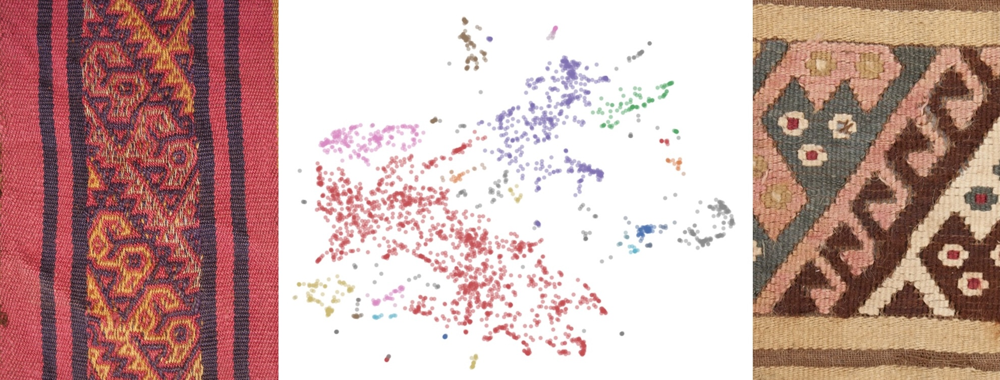

# _Dynamiques de transmission des techniques et des iconographies dans les textiles andins sur la longue durée_

GitHub contenant les données, scripts, notebooks et le rapport associés au mémoire : Lise Bernard, _Dynamiques de transmission des techniques et des iconographies dans les textiles andins sur la longue durée_, mémoire de master 2 « Humanités numériques et computationnelles », dir. Astrid Castres et Daniel Stockholm, Université Paris, Sciences & Lettres, 2024.

  

# __Pipeline du projet__

Chaîne de traitement (ou _pipeline_) implémentée au cours du mémoire.

  

# __Résumé__

À partir d’un corpus de 696 pièces textiles, ce mémoire examine les mobilités et les imitations tech- niques et iconographiques dans les tissages andins. Ce travail met en parallèle une approche géographique des mobilités textiles, à partir des métadonnées géographiques dont nous disposons sur ces textiles, et une approche de vision par ordinateur, à partir des images des textiles. Le recours à ces outils numériques variés permet de comparer les échanges textiles avec les phénomènes de ré-interprétations techniques et iconographiques, dans une approche diachronique sur la longue durée depuis 1800 avant J.C. jusquà la période contemporaine.

## __Navigation au sein du répertoire__

### Noms et contenus des dossiers

# Contenu du dépôt
- `data/` : 
  - `textile.csv` : document source principal et sa version nettoyée  `textile_clean.csv`.
  - `gdf_find.csv`et `gdf_find.csv` sont des tableaux contenant les informations géographiques des textiles.
  - `geo_data/`: dossier contenant les données QGIS
  - `runs/`: dossier contenant les résultats des entraînements YOLO
  - `images/` : images extraites de la base de données _Weaving Comunities of Practice.
  - `dataset_technique/` : dossier contenant les images pour la validation extérieur, aussi récipendiaire de la préparation du dataset pour la classification supervisée.
- `rapport/` : 
  - `rendu.pdf`: mémoire
  - `bib/`: dossier contenant les documents bibliographiques.
  - `images/`: dossier contenant les images nécessaires à la compilation du mémoire.
  - `source/`: dossier contenant les documents LaTex.
- `scripts/` :
  - `scrapTextiles_scripts/` : contient les scripts de _webcrapping_ des données.
  - `preprocessing/` : scripts pour le pré-traitement des données (dataframe, images) et les premières analyses exploratoires.
  - `SIG/` : scripts pour le géocodage (`geocoder_mapping.ipynb`) et l'analyse des données géographiques (`traitement_maps.ipynb`).
  - `computer_vision/` : 
    - Documents pour la gestions des environnements : `requirements_YOLO.txt` et `requirements_VGG16.txt`.
    - Script de classification supervisée des images.
    - Scripts de classification non-supervisée des images.
    - Script pour l'augmentation des données.
- `requirements.txt` : librairies nécessaire au fonctionnement des scripts.

### Gestion des environnements : 
L'ensemble des librairies nécessaires aux notebook est indiquée dans le document `requirements.txt`, exceptés deux scripts de _computer vision_ : 
- `classification_non_supervisee_VGG16.ipynb` nécessite les librairies indiquées dans `requirements_VGG16.txt`
- `classification_non_supervisee_YOLO.ipynb` et `classification_supervisee_YOLO.ipynb` nécessitent les librairies indiquées dans `requirements_YOLO.txt`
Ces deux derniers ont été développés en local, sur un MacBook Pro M2 (Metal).