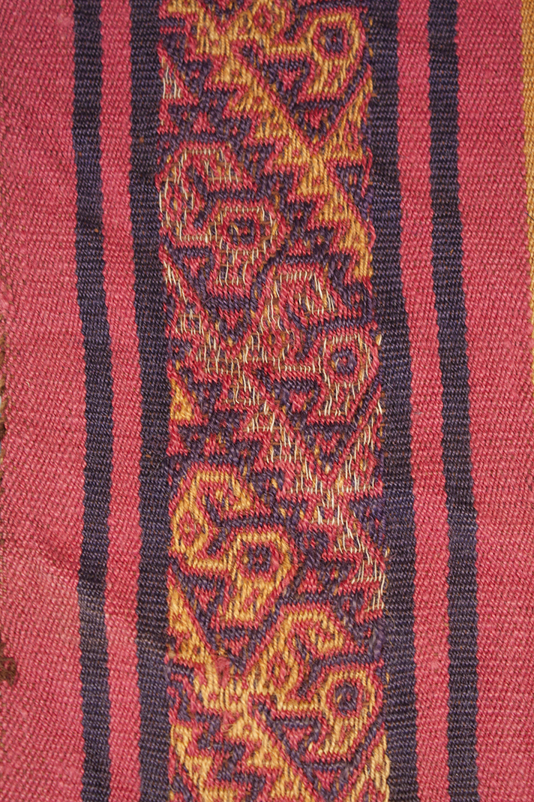
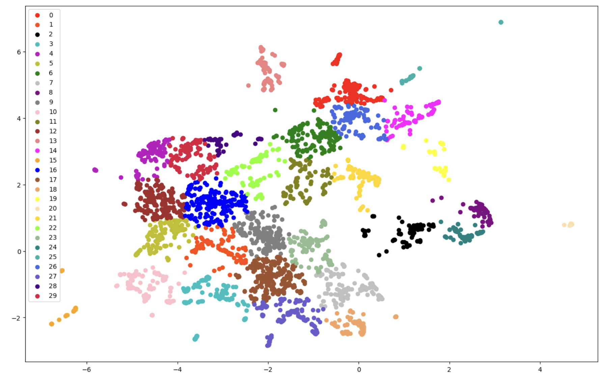
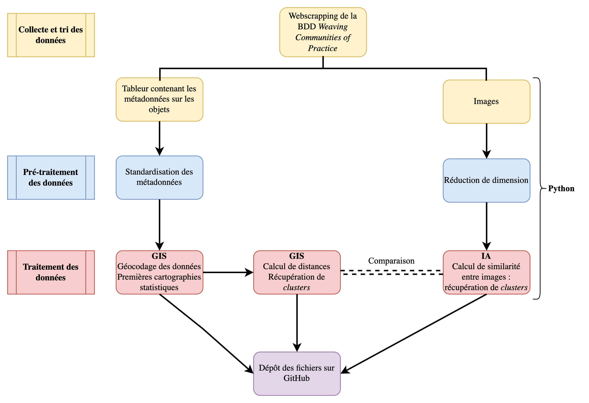

# _Dynamiques de transmission des techniques et des iconographies dans les textiles andins sur la longue durée_

GitHub contenant les données, scripts, notebooks et le rapport associés au mémoire : Lise Bernard, _Dynamiques de transmission des techniques et des iconographies dans les textiles andins sur la longue durée_, mémoire de master 2 « Humanités numériques et computationnelles », dir. Astrid Castres et Daniel Stockholm, Université Paris, Sciences & Lettres, 2024.

  
  

# __Pipeline du projet__

Chaîne de traitement (ou _pipeline_) implémentée au cours du mémoire.

  

# __Résumé__

À partir d’un corpus de 696 pièces textiles, ce mémoire examine les mobilités et les imitations tech- niques et iconographiques dans les tissages andins. Ce travail met en parallèle une approche géographique des mobilités textiles, à partir des métadonnées géographiques dont nous disposons sur ces textiles, et une approche de vision par ordinateur, à partir des images des textiles. Le recours à ces outils numériques variés permet de comparer les échanges textiles avec les phénomènes de ré-interprétations techniques et iconographiques, dans une approche diachronique sur la longue durée depuis 1800 avant J.C. jusquà la période contemporaine.

## __Navigation au sein du répertoire__

### Noms et contenus des dossiers

| Nom du dossier | Description |
| ----------- |  ---- |
| `data` | |
| `rapport` | |
| `scripts ` | |
| ` ` | |
| ` ` | |
| ` ` | |
| ` ` | |
| ` ` | |
| ` ` | |

### Gestion des environnements : 
L'ensemble des librairies nécessaires aux notebook sont indiqués dans le documents `requirements.txt`, exceptés deux scripts de _computer vision_ : 
- `classification_non_supervisee_VGG16.ipynb` nécessite les librairies indiquées dans `requirements_VGG16.txt`
- `classification_non_supervisee_YOLO.ipynb` et `classification_supervisee_YOLO.ipynb` nécessite les librairies indiquées dans `requirements_YOLO.txt`
Ces deux derniers ont été développés en local, sur un MacBook Pro M2 (Metal).